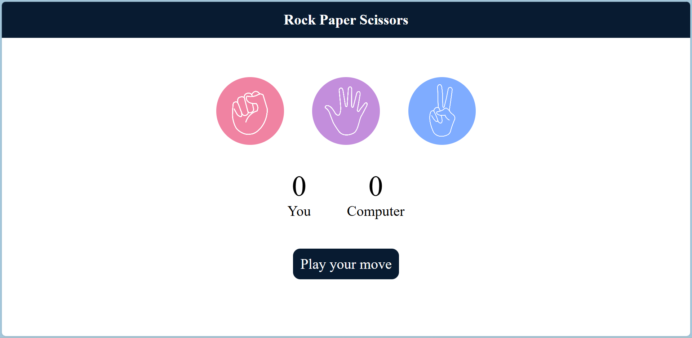

# Rock Paper Scissors Game

### Features  
- Interactive gameplay with visual elements for Rock, Paper, and Scissors.  
- Tracks scores for the user and the computer.  
- Displays messages indicating the result of each round (Win, Lose, or Draw).  
- Randomized computer choices for a fair game experience.  

### Technologies Used  
- **HTML**: Structure of the application.  
- **CSS**: Styling and layout design.  
- **JavaScript**: Game logic and interactivity.  

### Installation and Setup  
1. Clone the repository to your local machine:  
   ```bash
   git clone https://github.com/karthi1048/RPS-Project.git
2. Navigate to the project directory
3. Open the index.html file in your preferred web browser.
4. Enjoy the game!

### Usage  
1. Click on one of the three choices: **Rock**, **Paper**, or **Scissors**.  
2. The computer randomly selects its move.  
3. The winner is determined based on the standard rules:  
   - Rock beats Scissors.  
   - Scissors beats Paper.  
   - Paper beats Rock.  
4. The scores are updated for each round, and a message displays the outcome.  
5. The game continues until you decide to stop playing.  

### Screenshots  



### Contribution  
Contributions are welcome!  
1. Fork the repository.  
2. Create your feature branch: `git checkout -b feature-name`.  
3. Commit your changes: `git commit -m "Add some feature"`.  
4. Push to the branch: `git push origin feature-name`.  
5. Open a pull request.  

### Acknowledgements  
- Inspired by the classic Rock Paper Scissors game.  
